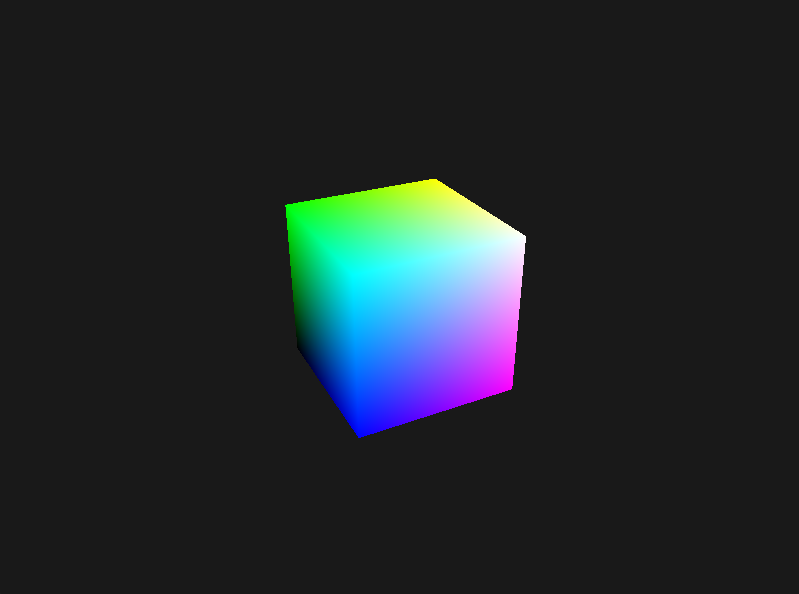

# NRI Cube Demo

This is a simple demo of rendering a colored spinning cube using [NRI](https://github.com/NVIDIA-RTX/NRI) in [Zig](https://ziglang.org/). ([zig-nri](https://github.com/Scythe-Technology/zig-nri))



## Testing
Run the demo directly:
```sh
zig build run
```

## Building
Compile to `zig-out/bin`: 
```sh
zig build
```

## License
[MIT License](LICENSE).